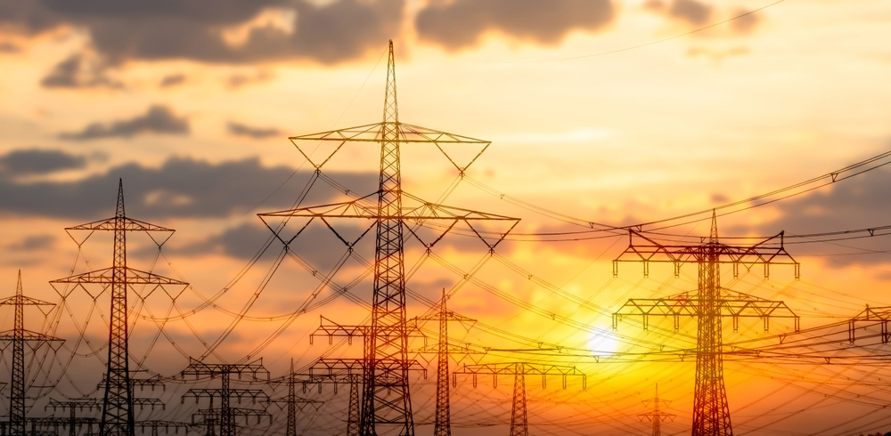

## Abstract

This paper examines the structural vulnerability of power grid infrastructure through the lens of complex network theory. By modeling the grid as a graph, the study employs centrality metrics — specifically Degree and Betweenness Centrality — to identify critical components. Vulnerability is assessed by simulating network disruptions, comparing the impact of random node failures (RND) against targeted attack strategies: Initial Degree (ID), Initial Betweenness (IB), Recalculated Degree (RD), and Recalculated Betweenness (RB). Findings indicate that Betweenness Centrality-based attacks, especially the Recalculated Betweenness (RB) strategy, are markedly more effective at fragmenting the network than degree-based or random removal strategies. This underscores the critical importance of nodes serving as bridges between network regions, which Betweenness Centrality effectively identifies. The research concludes that power grid topology is highly susceptible to targeted attacks on these bridging elements, suggesting that resilience efforts should prioritize the protection of components crucial for maintaining network connectivity. The presented analysis relies significantly on visual interpretation due to technical limitations encountered during the study, which prevented the implementation of more advanced algorithms explored within TIGER.

## Introduction

The potential vulnerabilities of the American power grid for a prolonged collapse have been the focus of several documentaries, movies, Congressional hearings and commissions and they live in the imagination of the public. The electrical power grid vulnerabilities and eventual grid collapse due to geomagnetic storms, electromagnetic pulse, cybersecurity, and cyberattacks as regards power plants and more seem to be more an imminent reality than a Fiction. So to understand more about the topic the intent of this report is to provide an objective summary of the current science and controversies on this issue.

### The Criticality and Fragility of Power Grids

Modern civilization is intrinsically linked to and deeply reliant upon the continuous and reliable supply of electrical power. Power grids function as the operational backbone for nearly all facets of contemporary life, underpinning economic stability, ensuring national security, supporting public health systems, and enabling essential daily activities @number1. These vast networks are not merely independent entities; they are foundational critical infrastructures upon which other vital systems, such as telecommunications, transportation, water supply, and financial services, depend. @ani2019review The interconnected nature of modern infrastructure means that disruptions within the power grid can cascade, causing widespread societal and economic paralysis.

Despite their criticality, power grids exhibit inherent fragility. Historical events serve as stark reminders of the potential consequences of grid failures. Large-scale blackouts, such as the 2021 Texas winter storm event @number8 and the 2003 Northeast blackout @number10, have left millions without power, often under hazardous conditions. The economic repercussions are staggering, with individual events potentially costing billions of dollars in direct damages and lost productivity. @number1
Beyond economic costs, the human toll is significant. Power outages compromise public health by disabling heating and cooling systems during extreme temperatures, disrupting access to essential medical services, and causing spoilage of food and medication reliant on refrigeration. @number1
The 2021 Texas failure, for instance, not only caused widespread hardship but also brought the entire state grid perilously close—within minutes—to a complete collapse that could have taken weeks or months to restore, highlighting the potential for catastrophic, long-term disruptions. @number8
Similarly, the devastation following Hurricane Maria in Puerto Rico underscored the prolonged societal impact of grid failure, with extended outages contributing to significant excess mortality and immense economic loss. @number10

### Escalating Threats and Increasing Complexity

The challenges facing power grid reliability are intensifying due to a confluence of escalating threats and growing system complexity. Climate change is driving an increase in the frequency and intensity of extreme weather events, which are a primary cause of power outages. @number9
Hurricanes, severe snow and ice storms, heatwaves, wildfires, and heavy rainfall events place immense physical stress on grid infrastructure, often exceeding the design limits of aging components. @number1
The 2021 Texas freeze @number8  and widespread summer heatwaves straining grids across the US @number10 exemplify this vulnerability. Aging transmission lines, transformers, and substations, many operating beyond their intended lifespans, are less resilient to these weather-related stresses. @number1

Simultaneously, the cyber threat landscape is evolving rapidly. Power grids are increasingly reliant on digital control systems (e.g., SCADA) and interconnected technologies, creating new avenues for malicious actors. @CraigFields
Cyber-attacks targeting grid operations are growing in sophistication and frequency, with state-sponsored actors and criminal groups demonstrating the capability to disrupt or damage grid components. @number9
The integration of renewable energy sources, while beneficial for sustainability, introduces new potential vulnerabilities through distributed energy resources (DERs) like solar inverters and their associated communication networks, which may lack the robust security protocols of traditional, centralized power plants. @number14

Physical threats also pose a significant and growing risk. Intentional attacks on substations and transmission infrastructure, including acts of sabotage, vandalism, and gunfire, have increased markedly in recent years. @number14
Copper theft from substations remains a persistent problem, causing damage and outages. @number15 
Inadequate physical security measures and the vast, often remote, expanse of grid infrastructure make physical protection challenging. @number15

These threats do not exist in isolation; they can interact and compound, creating scenarios far more damaging than standalone events. Extreme weather, for example, can physically stress the grid while simultaneously creating chaotic conditions that malicious actors might exploit for cyber-attacks, knowing the system is already vulnerable and response capabilities are strained. @number20 
Studies simulating such compound cyber-physical threats have shown significantly amplified impacts, with unmet electricity demand potentially tripling compared to a cyber-attack alone. @number20
Furthermore, physical vulnerabilities, such as poorly maintained infrastructure or inadequate site security, can directly enable cyber intrusions by providing physical access to supposedly secure network components. @number15
This interplay necessitates a vulnerability assessment approach that considers the potential synergy between different threat vectors.

The inherent complexity of the grid itself magnifies these vulnerabilities. Power systems are vast, interconnected networks spanning large geographical areas, often operated by multiple entities. 
This interconnectedness, while providing operational flexibility, also creates pathways for failures to cascade rapidly across the system. @kelic2017interdependencies
The ongoing energy transition, involving the integration of diverse and often intermittent renewable energy sources and the deployment of smart grid technologies, further increases operational complexity. @number14
While modernization aims to enhance efficiency and control, it paradoxically introduces new types of interdependencies and potential failure points, particularly in the cyber domain. @CraigFields 
This suggests a critical trade-off where technological advancements, if not implemented with integrated security and resilience considerations, can inadvertently expand the system's attack surface.

## Methods

In this study of graphs we refer as damaging the network as the removal of a node or edge in the graph. There are two primary ways a network can become damaged — (1) natural failure and (2) targeted attack. While random network failures regularly occur, they are typically less severe than targeted attacks. In contrast, targeted attacks carefully select nodes and edges in the network for removal in order to maximally disrupt network functionality. As such, we focus the majority of our attention to targeted attacks.

### Attack Strategies

The attack strategies are assessesing the immediate impact of component removals on the network's structure and connectivity, without explicitly modeling power flow dynamics.The node removal strategies rely on node and edge centrality measures to identify candidates. Below, we highlight several attack strategies:

* Random Node Removal (RND) - as the name suggests nodes or edges to be removed are picked at random.
* Initial degree removal (ID) - targets nodes with the highest degree. This has the effect of reducing the total number of edges in the network as fast as possible @holme2002attack, @beygelzimer2005improving. Since this attack only considers its neighbors when making a decision, it is considered a local attack.
* Initial betweenness removal (IB) - targets nodes with high betweenness centrality. This has the effect of destroying as many paths as possible \cite{holme2002attack, beygelzimer2005improving}. Since path information is aggregated from across the network, this is considered a global attack strategy.
* Recalculated degree removal (RD) and Recalculated betweenness removal (RB) - follow the same process as ID and IB, respectively, with one additional step to recalculate the degree (or betweenness) distribution after a node is removed. This recalculation often results in a stronger attack.

## Results

<!-- Add the Gephi sigma.js or the interactive Graph Visualization-->

Attack success is measured based on how fractured the network becomes when removing nodes from the network. In the process of attacking the network we could identify three key observations — (1)random node removal (RND) is not an effective strategy at all on this network structure; (2) Recalculated Betweenness Removal (RB) is the most effective attack strategy; and (3) the remaining attacks are roughly equivalent, falling somewhere between RND and RB.

We could gain insight into why RB is the most effective of the attacks just by visual observations. If we look carefully, we observe that certain nodes (and edges) in the network act as key bridges between various network regions. As a result, attacks able to identify these bridges are highly effective in disrupting this network. In contrast, degree based attacks are less effective, likely due to balanced degree distribution and being locally limited. The analysis is similar for edge based attacks.

<!-- Add figures -->

We can clearly see that Betweenness Centrality is a much more effective attack strategy, as well repeating this process we could observe that recalculating the Betweenness Centrality only compounded the effectiveness. Unfortunately due to python updates, deprecation in several packages and numerical instability with the Tensors. I could not implement a modern implementation of TIGER \cite{freitas2021evaluating}.

<!-- Add figures -->

## Conclusion

This research outlines the systemic vulnerability of power grid infrastructures. Highlighting the value of modeling the grid as a complex network and employing siple but powerfull attack strategies based on well known network porperties.

We can conclude that we are more close to the total collapse of society than we could expect and through the use of simple tools we could avoid what could become an imminent catastrophe.

Also, would like to highlight that due to time contraints and technical difficulties the study was limited to visual observations and intuition rather than a robust implementation of algorithms.

## References

::: {#refs}
:::
