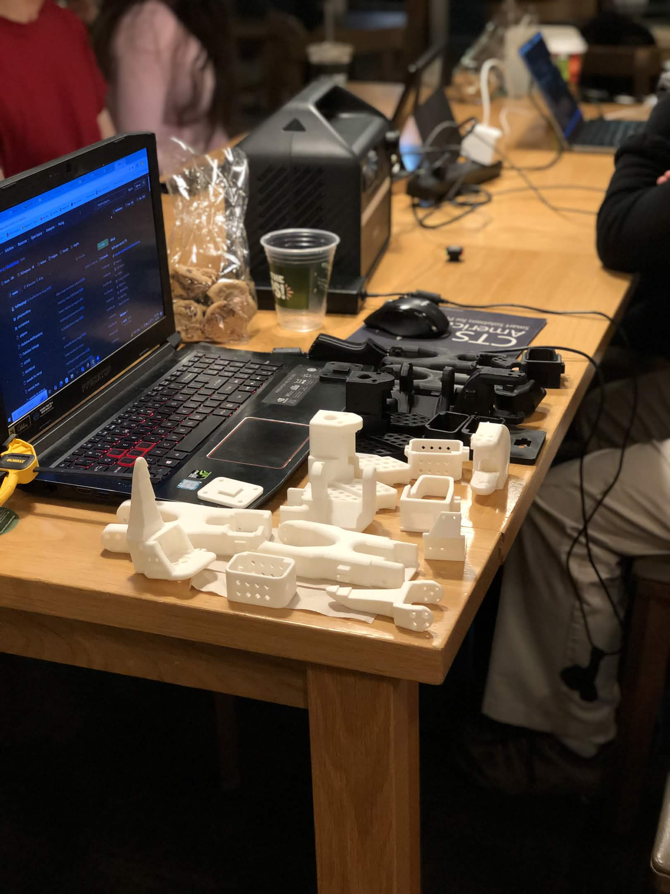
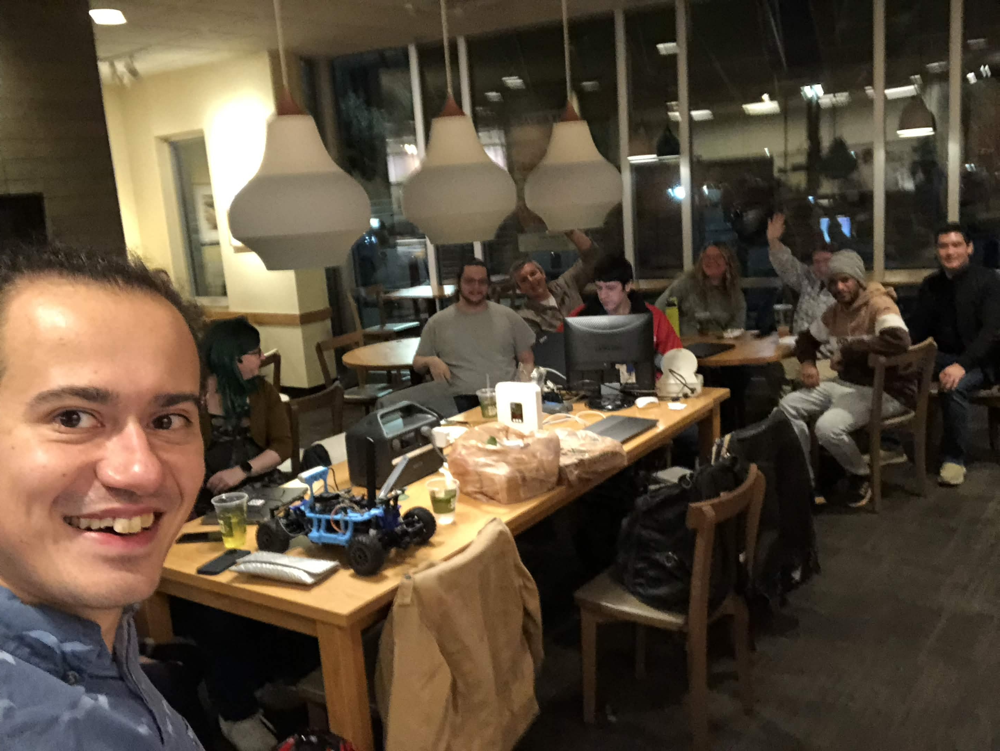
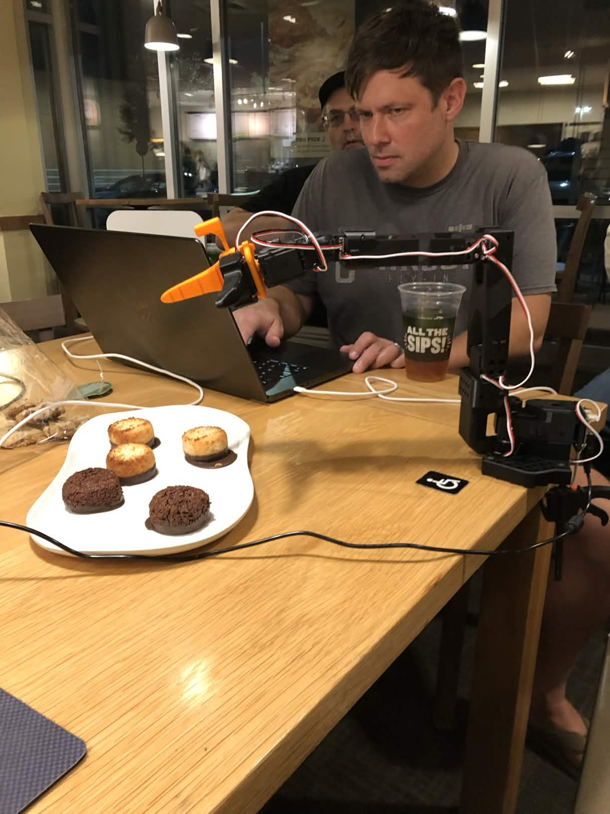
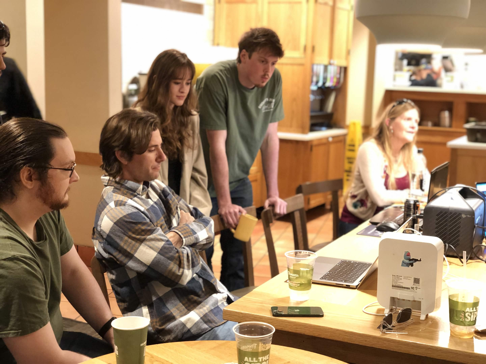

::: {.particles-content style="background: transparent;"}

::: {.glass-container}
## The Mission

Building **Physical AI** isn't just a software challenge --- it’s an infrastructure challenge. My work focuses on creating the simulation pipelines and models (RL, DL and more) that allow AI to move from the computer screen into the real world. 

Your sponsorship directly impacts the ability to:

- **Rent High-End GPUs** for large-scale Isaac Sim training.
- **Purchase Sensors & Actuators** for "Sim-to-Real" physical validation.
- **Maintain Open-Source Repositories** that lower the barrier for others.

::: {.callout-note appearance="simple"}
## Any Help is appreciated given Increased Cost of Hardware and Cloud Computing
:::
:::

::: {.glass-container}
## Support via Venmo

If my work has helped you, or if you believe in the future of accessible Physical AI research, consider a direct contribution via Venmo.

::: {.grid}

::: {.g-col-12 .g-col-md-6}
::: {.glass-card}
#### 📱 Scan to Donate

{width=200px style="border-radius: 10px; background: white; padding: 15px;"}
:::
:::

::: {.g-col-12 .g-col-md-6}
::: {.glass-card}
#### 🚀 Direct Link
Simply click the button below or search for my handle directly on Venmo.

**Venmo Handle:** `@Renan-Barbosa`

<a href="https://venmo.com/u/Renan-Barbosa" class="btn btn-venmo btn-lg" role="button" style="margin-top: 15px;">Donate via Venmo</a>

*Every contribution, no matter the size, makes a massive difference in hardware budget and cloud compute time.*

:::
:::

:::
:::

::: {.glass-container}
## Impact Roadmap

::: {.callout-note appearance="simple"}
## What Your Funds Enable for example:
- **$6:** One hour of cloud GPU on single L40S [g6e.8xlarge](https://instances.vantage.sh/aws/ec2/g6e.8xlarge?currency=USD).
- **$40:** One hour of cloud GPU training time on on 8x L40S [g6e.48xlarge](https://instances.vantage.sh/aws/ec2/g6e.48xlarge?currency=USD).
- **$400:** A Full Kit of the robot [SO-ARM101](https://partabot.com/products/so-arm101?variant=43026077155443)
- **$500:** A Depth Vision Camera [IntelRealsense D455](https://www.digikey.com/en/products/detail/realsense/99AVPN/16915893?gclsrc=aw.ds&gad_source=1&gad_campaignid=20243136172&gbraid=0AAAAADrbLlgg6JeqOI_ryfsw4-RQHcSM6&gclid=CjwKCAjwjtTNBhB0EiwAuswYhlglUQRNpKKRkbJKUYt3xxywzPRwzOkYFM7jwVraaKYH5Xc_JGeNQBoCFOoQAvD_BwE) 

Values are an approximation, donation of hardware and cloud credits are extremely helpful too. 
:::

## Free Workshops

Currently hold hands-on workshops at **Panera Bread** every other week: [Gathering of Aspiring Technologists (GOAT) Club](https://www.meetup.com/gathering-of-aspiring-technologists-goat-club/)

Unused Hardware (after project completion) are given away to help students and cloud credits lower the barrier of entry.

::: {.bento-wrapper}

::: {.bento-item .tall}

:::

::: {.bento-item .wide}

:::

::: {.bento-item .tall}

:::

::: {.bento-item .wide}

:::

:::

## What's Coming Next?
I'm currently working on a **Sim-to-Real** series focusing on training quadrupedal locomotion entirely in Isaac Sim and deploying to hardware. Your support helps buy the physical components needed for this deployment!

<a href="https://github.com/renanmb/boredengineer-quarto-website-test/discussions/2" target="_blank">
  <button style="background-color: #2ea44f; color: white; padding: 10px 20px; border: none; border-radius: 5px; cursor: pointer; font-weight: bold;">
    🗳️ Cast Your Vote on GitHub
  </button>
</a>
:::

::: {.glass-card}
### Thank You!
*Your support keeps the **"Bored Engineer"** from actually being bored --- and instead, keeps the robots moving.*

[Back to Projects](projects.qmd){.btn .btn-outline-secondary} [Check the Blog](blog.qmd){.btn .btn-outline-secondary}

:::

:::
